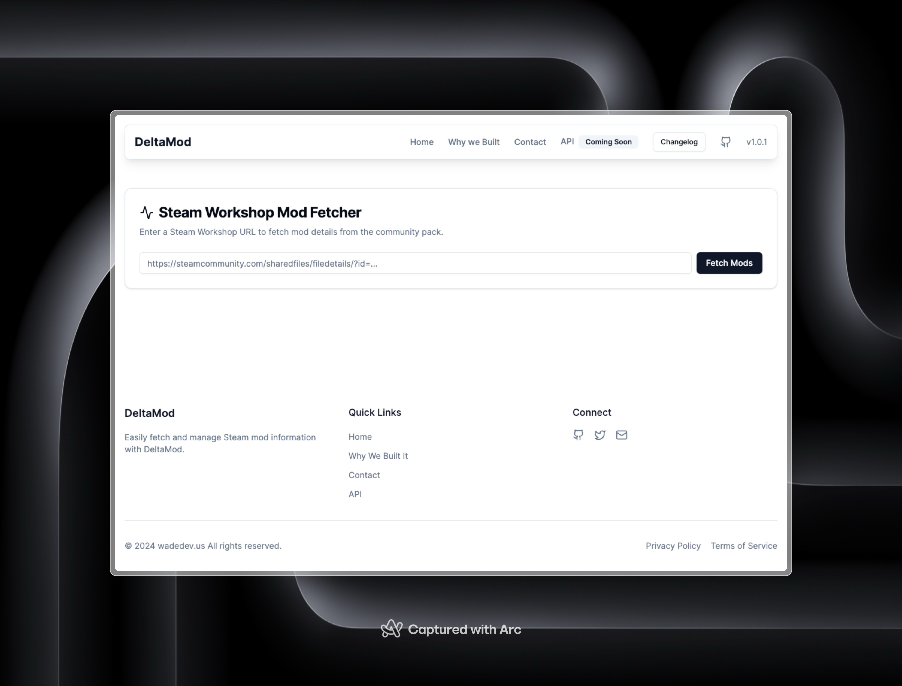
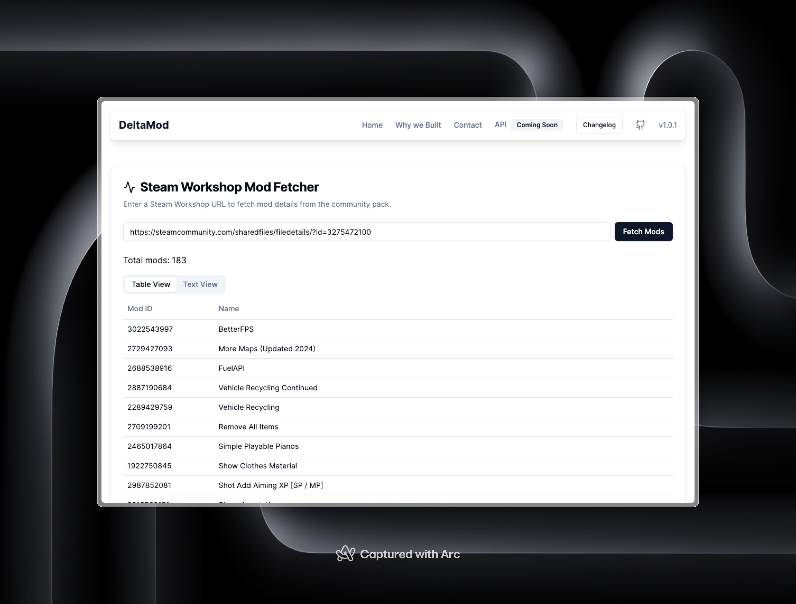
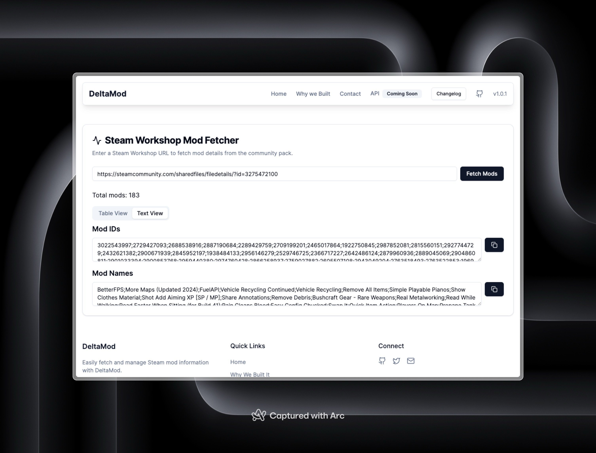

# Steam Workshop Mod Fetcher

[](https://steam-mods.wadedev.us)

Steam Workshop Mod Fetcher is a tool that allows users to easily fetch and manage Steam Workshop mod information. Simply enter a Steam Workshop URL to retrieve mod details and community pack information.

## Features

- **Fetch Mod Details**: Enter a Steam Workshop URL to get detailed information about mods.
- **User-Friendly Interface**: Clean and simple UI for easy navigation.
- **Responsive Design**: Optimized for both desktop and mobile devices.

## Showcase 

### Home Page


### Fetching Mod Details


### Mod Details Display



## Technologies Used

- [Next.js](https://nextjs.org/) - The React Framework for Production
- [TypeScript](https://www.typescriptlang.org/) - Typed JavaScript at Any Scale
- [Tailwind CSS](https://tailwindcss.com/) - Utility-First CSS Framework
- [Supabase](https://supabase.io/) - Open Source Firebase Alternative

## Getting Started

To get a local copy up and running follow these simple steps.

### Prerequisites

- Node.js
- npm or yarn

### Installation

1. Clone the repo
   ```sh
   git clone https://github.com/wadedesgin/steam-workshop-mod-fetcher.git
    ```

2. Install NPM packages
   ```sh
   npm install
   ```

3. Start the development server
   ```sh
    npm run dev
    ```

4. Open your browser and navigate to `http://localhost:3000`


